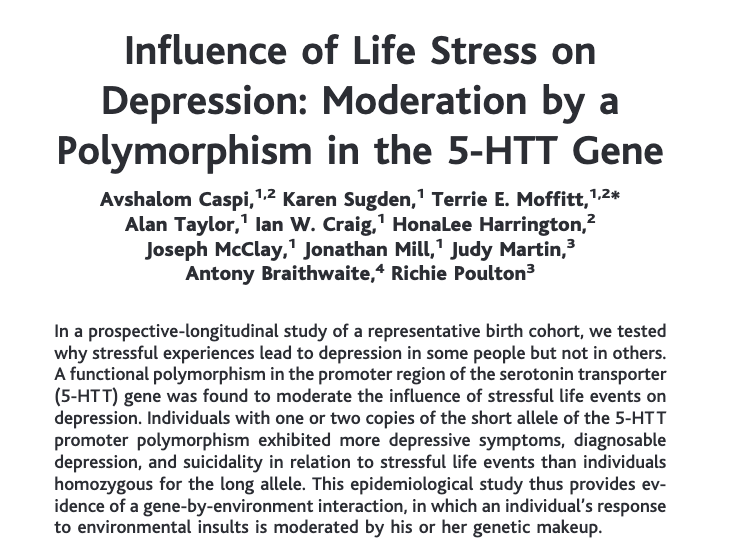
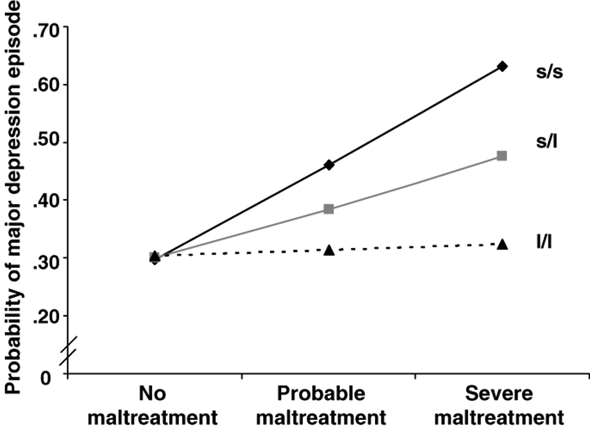
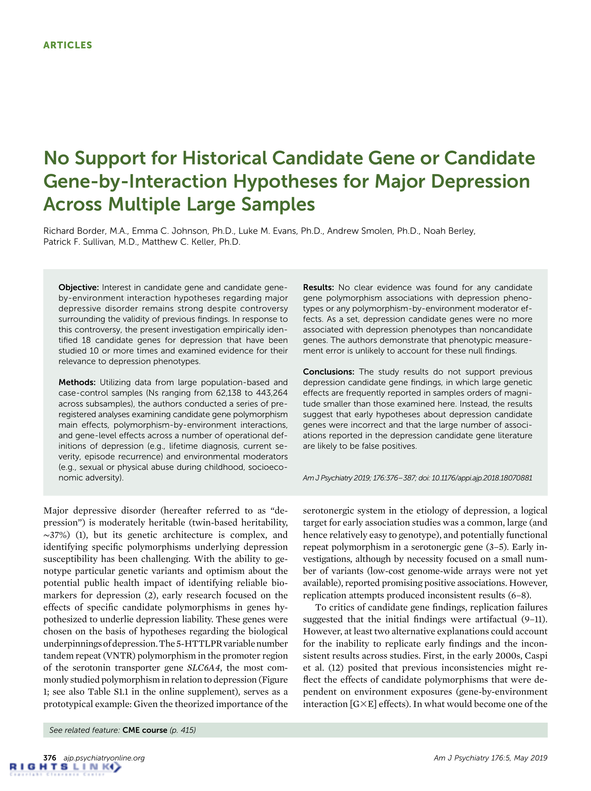
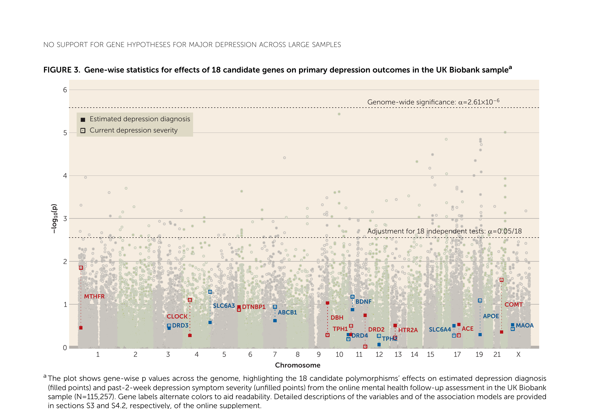
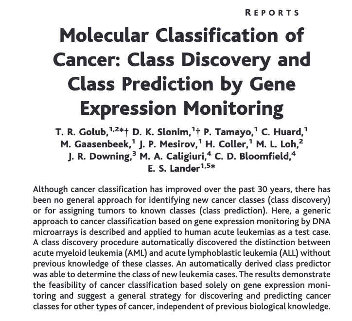
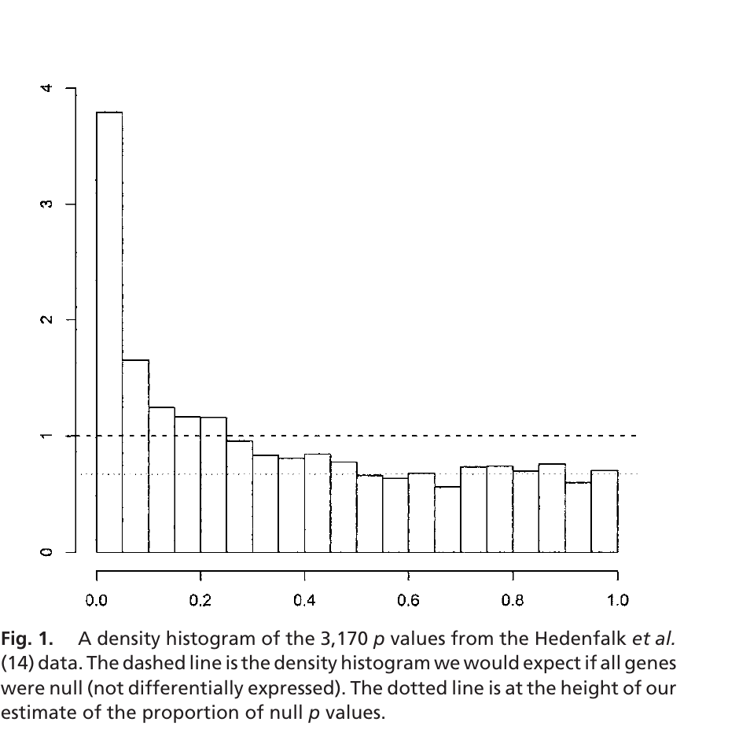
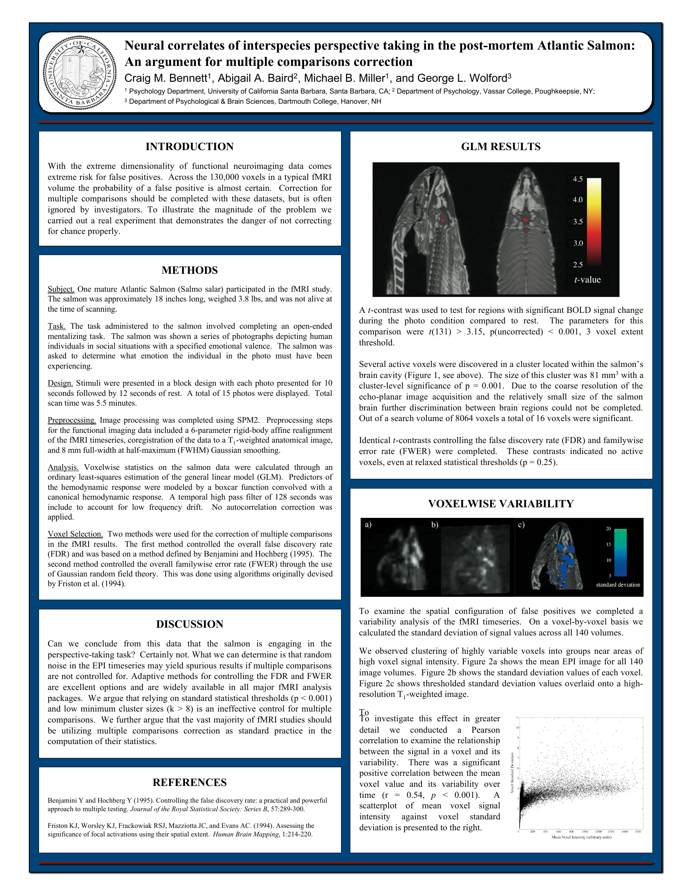
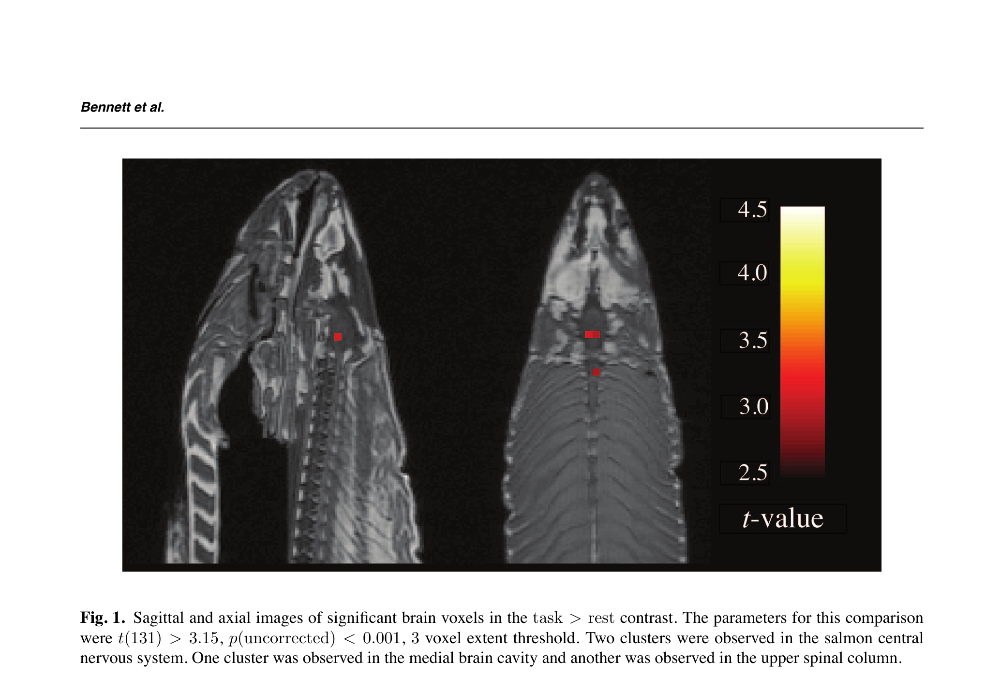

```{=html}
<style>
.reveal .slides { font-size: 0.78em; }
.reveal h1 { font-size: 2.4em; }
.reveal h2 { font-size: 1.5em; }
.reveal table { font-size: 0.9em; }
.reveal blockquote { font-size: 0.95em; }
</style>
```

## Caspi 2003: a single gene moderating stress-induced depression

:::: {.columns}
::: {.column width="55%"}
{fig-alt="Title page of Caspi et al. 2003, Science: 'Influence of life stress on depression: moderation by a polymorphism in the 5-HTT gene'" width="100%"}
:::
::: {.column width="45%"}
**The proposal**

A variant in the serotonin transporter gene (5-HTTLPR, in the promoter region of *SLC6A4*) moderates how individuals respond to stressful life events.

**The mechanism, as advanced**

- "Short" allele → less transporter protein → reduced serotonin uptake
- Carriers of the short allele are more vulnerable to stress-induced depression
- "Long" allele carriers are protected

**Why it captured the field**

A simple, biologically plausible nature × nurture story: a single locus that determines who breaks under adversity.
:::
::::

::: {.notes}
Caspi et al. (2003) appeared in *Science* and proposed a gene-by-environment interaction. The hypothesis was clean — a specific, mechanistically plausible polymorphism that connects a known neurotransmitter system to a complex psychiatric phenotype. We will see in the next slide why this finding, despite being elegant, did not survive replication.
:::

---

## The claim: stress matters only for short-allele carriers

:::: {.columns}
::: {.column width="55%"}
{fig-alt="Caspi et al. 2003 Figure 2: probability of major depression episode versus maltreatment, stratified by 5-HTTLPR genotype (s/s, s/l, l/l)" width="100%"}
:::
::: {.column width="45%"}
**How to read the figure**

- x-axis: maltreatment severity in childhood
- y-axis: probability of a major depression episode
- Three lines: one per 5-HTTLPR genotype

**s/s** (two short alleles): probability rises from ~0.30 to ~0.63 with maltreatment.

**l/l** (two long alleles): essentially flat near 0.30.

The gene appears to *moderate* the effect of stress: only short-allele carriers respond to maltreatment with elevated depression risk.
:::
::::

::: {.notes}
This is the key figure of Caspi 2003. A single longitudinal cohort (Dunedin, New Zealand, ~847 individuals followed from birth), genotyped at the serotonin transporter promoter. The claim is gene-by-environment interaction: the s/s and s/l carriers are stress-sensitive; the l/l carriers are protected.

The paper has been cited roughly 11,000 times on Google Scholar by 2026 — a well-cited paper in genetics typically gets a few hundred citations, a famous one gets 1,000. Eleven thousand marks a field-defining result. It launched a subfield, anchored textbooks, and shaped 15 years of follow-on research.

Hold this picture in mind; Border et al. (2019) tested the same claim in samples 100× larger, and the result will not survive.
:::

---

## A field-defining finding — and an inconsistent replication record

:::: {.columns}
::: {.column width="50%"}
**Citations (2003–2025)**

| Paper | Citations |
|---|---:|
| Typical human-genetics paper | ~200 |
| Famous landmark | ~1,000 |
| Caspi et al. 2003 | **~11,000** |

Eleven thousand citations (Google Scholar, 2026) marks a field-defining result — the kind that anchors textbooks and launches subfields.
:::
::: {.column width="50%"}
**Replication attempts, 2003–2018**

Hundreds of studies attempted to reproduce the 5-HTTLPR × stress interaction.

- **Some** reported the same direction of effect.
- **Some** reported the opposite direction.
- **Some** found no effect at all.
- Meta-analyses **disagreed with each other** depending on which studies they included.

This pattern is itself a diagnostic. When an effect is real, replications converge on a direction and approximate size. Disagreement across the literature is what *noise* looks like.
:::
::::

::: {.notes}
The point of this slide: a finding cited 11,000 times nevertheless produced 15 years of contradictory replications. Citations measure influence, not truth. A heavy citation count means the result entered the textbooks; it does not mean the result was correct. The replication pattern — positive, negative, and null in roughly equal measure — was visible the whole time and should have been read as evidence against the original claim. The field nevertheless continued to interpret ambiguous evidence in its favor: the biology was plausible, the original study was well-designed by the standards of its era, and a sufficient number of "confirmatory" replications kept the hypothesis alive.
:::

---

## Sixteen years later: a definitive test of 18 candidate genes

:::: {.columns}
::: {.column width="55%"}
{fig-alt="Title page of Border et al. 2019, American Journal of Psychiatry" width="100%"}
:::
::: {.column width="45%"}
Border et al. (2019) retested the 5-HTTLPR hypothesis — and **17 other historical "candidate gene" hypotheses** for depression — in samples ranging from 62,000 to 443,000 individuals.

Preregistered analysis plan. Same outcomes, same statistical approaches as the original studies. Only the sample size differed: roughly 100× larger.

> "No clear evidence was found for any candidate gene polymorphism associations with depression phenotypes or any polymorphism-by-environment moderator effects."

— Abstract, Border et al. 2019
:::
::::

::: {.notes}
The Caspi 2003 paper started a wave: dozens of "candidate genes" were proposed for depression, each based on small studies that found significant effects. Border 2019 was the definitive replication attempt, designed specifically to revisit this entire literature with adequate statistical power.
:::

---

## All 18 genes — including the Caspi gene — fall below significance

:::: {.columns}
::: {.column width="62%"}
{fig-alt="Border et al. 2019 Figure 3: gene-wise -log10(p) values for 18 candidate genes plotted by chromosome; none exceed the genome-wide significance threshold of 2.61e-6" width="100%"}
:::
::: {.column width="38%"}
**Reading the plot**

- Each point: one variant in one gene
- y-axis: $-\log_{10}(p)$ — bigger means stronger evidence
- Dashed line: significance threshold

**SLC6A4 is 5-HTTLPR** — the Caspi gene. Same finding to test, vastly more data.

**None of the 18 candidate genes** crosses the genome-wide threshold. (One marginal hit, DRD2 in a sub-sample, did not replicate in UK Biobank — see paper.)

The 5-HTTLPR effect was not "smaller than originally reported." It was absent.
:::
::::

::: {.notes}
This is the figure. Eighteen candidate genes. Zero replication. Make the SLC6A4 = 5-HTTLPR equivalence explicit if it hasn't already landed — SLC6A4 is the gene name; 5-HTTLPR is the polymorphism in its promoter region. Same locus, different naming convention.

The dashed line at $\alpha = 2.61 \times 10^{-6}$ is the Bonferroni-style correction for the ~19,000 SNP tests across the candidate-gene tagging set (Border 2019 tested every SNP within each candidate gene's region, then applied Bonferroni to the resulting test count, *not* to the 18 genes themselves). The genome-wide convention is $5 \times 10^{-8}$, which is stricter still; we will return to it.

Don't yet explain the mechanisms — just establish the empirical fact: when the test was rerun at scale, with preregistration and adequate power, none of the historical candidate-gene claims for depression held up. The rest of the lecture builds the framework for why this is the expected outcome when many small studies are run without proper multiple-testing correction.
:::

---

# The Golub Dataset {.centered}

::: {style="text-align: center; font-size: 0.7em; margin-top: 1em; color: #555;"}
3,051 genes × 72 leukemia patients — the workshop's running example.
:::

::: {.notes}
Shift gears. "Let's start with a dataset."
:::

---

## Golub 1999: the workshop's running example

:::: {.columns}
::: {.column width="55%"}
{fig-alt="Golub et al. 1999, Science: 'Molecular classification of cancer: class discovery and class prediction by gene expression monitoring'" width="100%"}
:::
::: {.column width="45%"}
**The claim**

Gene expression alone — not morphology, not cytochemistry — can distinguish two leukemias: **ALL** (acute lymphoblastic) and **AML** (acute myeloid).

**The technology**

DNA microarrays measure the expression of thousands of genes per patient simultaneously. After preprocessing, the released dataset reports **3,051 genes per patient**.

**Why it matters here**

- One of the first public datasets where $p \gg n$ (many genes, few patients).
- Drives the rest of the workshop — every lab and several lectures revisit it.
- The same statistical problem that broke 5-HTTLPR appears immediately on this dataset.
:::
::::

::: {.notes}
Golub et al. (1999) is, in many ways, the founding example of the kind of dataset this workshop is about. It introduced the genomics community to high-dimensional inference at scale: thousands of variables, dozens of samples, and a clear scientific question (can expression patterns classify cancer subtypes?). It is also small enough that students can run every procedure in this workshop on a laptop in seconds.
:::

---

## The Golub data at a glance

::: {style="font-size: 1.3em;"}
| | |
|---|---|
| **Patients** | 72 |
| **Genes** | 3,051 |
| **ALL** | 47 |
| **AML** | 25 |
| **Ratio p/n** | ~42 |
:::

::: {.notes}
The 72 patients fall into two groups: 47 with ALL and 25 with AML. These are different types of leukemia — they have different prognoses, different treatment responses, different biology. The question is: which genes are expressed differently between the two types?

This is a perfectly reasonable question. A clinician might want to know which genes distinguish the types so they can develop better diagnostics. A biologist might want to understand the molecular basis of the distinction.

So you do what anyone would do. You take each gene, one at a time, and ask: is this gene expressed at a different level in ALL patients than in AML patients? The standard tool is a t-test. You compute a test statistic, you get a p-value, and you decide whether the difference is "statistically significant." Do this for all 3,051 genes and you get 3,051 p-values.
:::

---

## Under the global null, 153 "discoveries" are expected by chance

:::: {.columns}
::: {.column width="40%"}
::: {style="font-size: 1.6em; text-align: center; margin-top: 1em;"}
$$3{,}051 \times 0.05$$

$$= 153$$
:::
:::
::: {.column width="60%"}
**The setup**

- Run one $t$-test per gene on the Golub data: 3,051 tests.
- A $p$-value of 0.05 means: under $H_0$ (no difference between ALL and AML for *this* gene), there is a 5% chance of obtaining a test statistic at least as extreme as the observed one.

**The thought experiment**

Imagine for a moment that *no* gene actually differs between ALL and AML. Each test independently has a 5% chance of crossing $p < 0.05$ purely by chance.

$$\text{Expected false positives} = m \cdot \alpha = 3{,}051 \times 0.05 \approx 153.$$

**The trap**

The per-test error rate is still 5%. The *count* of false positives, however, is 153 — a long list that visually resembles a discovery.

A biologist scanning the output sees genes, not rates.
:::
::::

::: {.notes}
This is the multiple testing problem in one line of arithmetic. The mathematics is first-semester probability; what is non-obvious is how a 5% per-test error rate translates into a list of 153 "significant" findings that look like science. The Golub data isn't actually pure noise — many genes truly differ between ALL and AML — but the same arithmetic still applies to whatever fraction of the genome is null. The same logic broke 5-HTTLPR: a literature of small studies, each appearing to be a single test, was in aggregate an enormous number of implicit tests at an unadjusted 5% per-test rate.
:::

---

# The P-Value Histogram {.centered}

::: {style="text-align: center; font-size: 0.7em; margin-top: 1em; color: #555;"}
The single most informative display in high-dimensional inference.
:::

::: {.notes}
"I want to show you the single most useful plot in high-dimensional statistics. It's not a volcano plot. It's not a heatmap. It's a histogram of p-values."
:::

---

## What "nothing" looks like

```{python}
#| label: null-histogram
#| fig-height: 5
#| fig-width: 9
#| echo: false
import numpy as np
import matplotlib.pyplot as plt

rng = np.random.default_rng(123)
null_pvals = rng.uniform(size=3051)

fig, ax = plt.subplots(figsize=(9, 5))
ax.hist(null_pvals, bins=50, color="gray", edgecolor="white")
ax.axhline(y=3051 / 50, color="red", linestyle="--", linewidth=2)
ax.set_title("Simulated: all genes are null", fontsize=15)
ax.set_xlabel("P-value", fontsize=13)
ax.set_ylabel("Frequency", fontsize=13)
plt.tight_layout()
plt.show()
```

::: {.notes}
Here's what you'd see if none of the genes were differentially expressed: a flat histogram. Uniform. Equal numbers of p-values in every bin. This is because, under the null hypothesis, p-values are uniformly distributed between 0 and 1. That's not an approximation or an asymptotic result — it's exact. Technically, this is true for continuous test statistics. Discrete test statistics produce p-values that are stochastically larger than uniform, which makes the test conservative. For gene expression data with continuous measurements, the uniform assumption is essentially exact. If nothing is going on, every bin gets the same number of p-values. Memorize this shape — it's your baseline.
:::

---

## The Golub data

```{python}
#| label: all-histogram
#| fig-height: 5.5
#| fig-width: 10
#| echo: false
import pandas as pd
from scipy import stats

expr = pd.read_csv("../data/golub_expression.csv", index_col=0)
meta = pd.read_csv("../data/golub_metadata.csv", dtype={"sample_id": str})
# Guard against any future re-export with reordered columns:
assert list(expr.columns) == list(meta["sample_id"]), "expr/meta sample order mismatch"
subtype = meta["subtype"].values
all_mask = subtype == "ALL"

_, pvals = stats.ttest_ind(expr.loc[:, all_mask].values, expr.loc[:, ~all_mask].values, axis=1)

fig, ax = plt.subplots(figsize=(10, 5.5))
ax.hist(pvals, bins=100, color="steelblue", edgecolor="white")
ax.axhline(y=len(pvals) / 100, color="red", linestyle="--", linewidth=2)
ax.legend(["Expected if all null"], loc="upper right", fontsize=12, frameon=False)
ax.set_title("P-value histogram: 3,051 genes, ALL vs. AML", fontsize=15)
ax.set_xlabel("P-value", fontsize=13)
ax.set_ylabel("Frequency", fontsize=13)
plt.tight_layout()
plt.show()
```

::: {.notes}
Now consider the Golub data. The histogram is not flat. There is a pronounced spike near zero — hundreds of genes with very small p-values — and then a roughly flat region for the rest. The spike is signal: genes that are genuinely differentially expressed between ALL and AML. The flat part is the null genes — the genes where no real difference is present, producing the uniform distribution we would expect.

Don't explain yet. Ask the audience: "What do you see?" Let them describe it — spike near zero, flat region, excess above the red line. Then confirm what they said.
:::

---

## Three things this histogram tells you

::: {style="font-size: 1.2em;"}

1. **Is there signal?** Spike near zero → yes.

2. **How much?** The flat part estimates π₀ (fraction of null genes).

3. **Is your analysis trustworthy?** Flat part should be flat. If not, something is wrong.

:::

::: {.notes}
This one plot tells you three things. First, whether there's signal. If the histogram is flat, there is nothing to detect. If there's a spike near zero, something real is happening.

Second, roughly how much signal. The height of the flat part tells you the density of null p-values. If the flat part is at, say, 80% of the total, then roughly 80% of your genes are null and 20% are non-null. In the Golub data, the spike is substantial — ALL and AML are genuinely different diseases, and the transcriptomic differences are large.

Third, whether your analysis is trustworthy. A well-behaved analysis produces a histogram with a flat right side and a spike on the left. But sometimes the histogram looks wrong. If the bars increase toward the right — more large p-values than expected — your test is conservative. If there's a bump in the middle, something is off with your test statistics. If the entire histogram is shifted left with no flat region, your null model is wrong. These pathological histograms are surprisingly common, and they tell you to stop and fix your analysis before interpreting any results.

I want you to internalize this: before you look at gene lists, before you compute adjusted p-values, before you run any correction procedure — plot the histogram. It takes ten seconds and it tells you whether the rest of your analysis is worth doing.

A few slides from now we will use this same histogram to construct the BH and Storey thresholds; in Lecture 2 we will go further still and use it to estimate quantities — π₀, $f_1$, and a per-test posterior probability of being null. The flat part is the central object of both lectures.
:::

---

## The canonical diagnostic: spike + flat tail with two reference lines

:::: {.columns}
::: {.column width="58%"}
{fig-alt="Storey & Tibshirani (2003) Figure 1: p-value histogram from the Hedenfalk breast cancer dataset; dashed line at the uniform-null density, dotted line at the estimated null proportion" width="100%"}
:::
::: {.column width="42%"}
**How to read the figure**

- x-axis: $p$-value across $[0,1]$.
- y-axis: density (the histogram is density-scaled).
- **Dashed line at 1:** density if every gene were null ($p$-values uniform).
- **Dotted line below it:** estimated density of the null genes, $\hat\pi_0$, read off the flat region.

**Takeaway.** That second line is the central quantity. Its height is $\hat\pi_0$ — the estimated *proportion* of true nulls in the experiment, which is what makes the false discovery rate computable. Storey's $q$-value (next sub-section) and Efron's two-groups model (Lecture 2) are both built on this number.
:::
::::

::: {.notes}
This is the canonical version of the diagnostic, from Storey & Tibshirani (2003). The histogram is the 3,170 p-values from the Hedenfalk breast cancer dataset — a different experiment from Golub, but the same shape: a spike near zero, then a roughly flat tail.

Two reference lines. The **dashed** line at height 1 is what you would see if all genes were null — p-values uniformly distributed, density equal to 1 in every bin. The **dotted** line, lower, is at the estimated density of the null genes — π₀ — which Storey and Tibshirani read directly off the flat region.

That second line is the key idea. The height of the flat tail is not just descriptive — it estimates the proportion of true nulls in the experiment, and that proportion is what makes the false discovery rate computable. Storey's q-value (later in this lecture) is built around exactly this estimator; Efron's two-groups model (Lecture 2) uses it as the mixture weight on the null component. For now, just internalize the picture: spike + flat, with the flat region at some height below 1. That height is π₀, and π₀ is the difference between Bonferroni and BH.
:::

---

# Bonferroni and Family-Wise Error Rate Control {.centered}

::: {style="text-align: center; font-size: 0.7em; margin-top: 1em; color: #555;"}
The right tool when even one false positive is unacceptable — and the wrong tool for discovery.
:::

::: {.notes}
"So you have 3,051 p-values and a histogram that shows real signal. You want to call some genes significant. But you know that if you use the standard 0.05 threshold, you'll get over a hundred false positives mixed in with the real results. What do you do?"
:::

---

## Bonferroni: divide the per-test threshold by $m$

:::: {.columns}
::: {.column width="45%"}
**The correction**

::: {style="font-size: 1.4em; text-align: center; margin-top: 0.5em;"}
$$p < \frac{\alpha}{m} = \frac{0.05}{3{,}051}$$

$$\approx 1.6 \times 10^{-5}$$
:::

By the union bound,

$$P(\text{at least one FP}) \leq m \cdot \frac{\alpha}{m} = \alpha.$$
:::
::: {.column width="55%"}
**What it controls**

The **family-wise error rate (FWER)**: the probability of *any* false positive across the entire family of tests.

$$\text{FWER} = P(\text{any false positive}) \leq 0.05.$$

**When it's the right tool**

- Astronomy "5σ" detection: per-test error rate $\sim 1/3{,}500{,}000$. One false discovery would mis-announce a physical law.
- GWAS: $5 \times 10^{-8}$ threshold across $\sim$1 million SNPs — Bonferroni at genome-wide scale.

**Strengths**

- No assumption about the dependence structure among tests.
- Works at any scale, from 10 to 10⁶ hypotheses.
- Easy to communicate and reproduce.
:::
::::

::: {.notes}
Bonferroni is the simplest possible correction: divide your significance level by the number of tests. You want the probability of making any false positive — even one — to be at most 5%. This is the family-wise error rate, or FWER. If each individual test has a false positive probability of α/m, then by the union bound, the probability that at least one of the m tests produces a false positive is at most m × (α/m) = α.

Bonferroni is clean, easy to explain, and requires no assumptions about the dependence structure of your tests — it works whether your genes are independent or correlated, and whether you're testing 10 hypotheses or 10 million. The genome-wide threshold $5 \times 10^{-8}$ is essentially Bonferroni at the million-SNP scale, refined for linkage disequilibrium. Caspi's 5-HTTLPR study did not face Bonferroni at this scale — it was framed as a single-test confirmation of a *specific* hypothesis. The pathology described in this lecture comes from the candidate-gene literature treating each study as a single test, while the field collectively ran thousands of implicit tests.

Bonferroni does what it promises: applied to 3,051 tests, the probability that any of your declared significant genes is a false positive is at most 5%. In the next slide we will see what it costs: the threshold becomes so stringent that most real signal is rejected. The problem isn't that Bonferroni is broken — it's that it controls the *wrong thing* for a discovery-oriented analysis.
:::

---

## Where is the threshold?

```{python}
#| label: bonf-histogram
#| fig-height: 5.5
#| fig-width: 10
#| echo: false
bonf_threshold = 0.05 / len(pvals)

fig, ax = plt.subplots(figsize=(10, 5.5))
ax.hist(pvals, bins=100, color="steelblue", edgecolor="white")
ax.axvline(x=bonf_threshold, color="red", linewidth=3)
ax.annotate(f"← Bonferroni: {bonf_threshold:.2e}", xy=(bonf_threshold + 0.015, ax.get_ylim()[1] * 0.9),
            color="red", fontsize=13)
ax.set_title("The Bonferroni threshold", fontsize=15)
ax.set_xlabel("P-value", fontsize=13)
ax.set_ylabel("Frequency", fontsize=13)
plt.tight_layout()
plt.show()
```

::: {.notes}
Think about what the family-wise error rate actually means. It's the probability of any false positive. Any. Even one. In a list of 500 significant genes, Bonferroni demands a guarantee that not a single one is a false discovery. That's an extraordinarily high standard. And to achieve it, the threshold becomes so stringent that you miss most of the real signal.

You can barely see the red line. It's jammed against zero. Only the very tip of the spike survives. Everything else — including real signal — gets thrown away.

If you're an astronomer and you're about to announce the discovery of gravitational waves, yes, you want to be very sure you haven't made even one false positive. The standard there is "five sigma," roughly one in 3.5 million. The cost of a false claim is enormous.

But if you're a biologist screening 3,051 genes to find candidates for follow-up experiments, you're in a completely different situation. You don't need a guarantee that every gene on your list is real. You need a useful list — one where most of the genes are real and the false positives are a manageable fraction. If your list of 500 genes contains 25 false positives, that's a 5% false discovery rate, and for most biological applications, that's fine. You'll validate the interesting ones in follow-up experiments anyway.

Bonferroni can't give you that list. It's trying to prevent a different kind of error — any error at all — and in doing so, it throws away most of your real discoveries.
:::

---

## A deliberate demonstration: fMRI on a dead Atlantic salmon

:::: {.columns}
::: {.column width="55%"}
{fig-alt="Bennett, Miller and Wolford 2009 HBM conference poster: 'Neural correlates of interspecies perspective taking in the post-mortem Atlantic salmon'" width="100%"}
:::
::: {.column width="45%"}
**The experiment** (Bennett et al., HBM 2009 poster; published in the *Journal of Serendipitous and Unexpected Results* in 2010)

A dead Atlantic salmon was placed in an fMRI scanner and "shown" photographs of humans in social situations. A standard fMRI analysis pipeline tested ~8,000 in-brain voxels (of ~130,000 in the full scan volume) for signal change in response to the stimuli.

**Why this matters**

Every fMRI analysis tests tens of thousands of voxels — the exact analogue of testing thousands of genes. The multiple-testing problem is structurally identical to the one in the Golub data.

**The companion survey**

Bennett, Wolford & Miller (2009) audited the published fMRI literature: a substantial fraction — roughly a quarter to a third of the studies surveyed — did not report any correction for multiple comparisons. The poster was memorable; the survey was a serious indictment.
:::
::::

::: {.notes}
The poster was presented at the Human Brain Mapping (HBM) 2009 conference and later published in the *Journal of Serendipitous and Unexpected Results* (2010). It was deliberate satire — a control experiment that everyone knew should produce nothing — designed to show why uncorrected statistics are dangerous in a high-dimensional setting. Use this to make the multiple-testing problem visceral: nobody believes the salmon is thinking, so the false positive is unambiguous.
:::

---

## Without correction, "significant activity" in the dead salmon's brain

:::: {.columns}
::: {.column width="55%"}
{fig-alt="Bennett et al. 2010 Figure 1: sagittal and axial fMRI slices of a post-mortem Atlantic salmon showing red activation voxels in the brain cavity and spinal column when no multiple-testing correction is applied" width="100%"}
:::
::: {.column width="45%"}
**Reading the image**

- Sagittal (left) and axial (right) slices through the salmon's head.
- Red voxels: "significant" task-related signal at $p < 0.001$ uncorrected, 3-voxel extent threshold.
- Color scale: $t$-statistic from 2.5 to 4.5.

**With correction**

At Bonferroni FWER $\le 0.05$ ($p < 0.05/8064$) or FDR-corrected $q < 0.05$ — Bennett's actual reported thresholds — the apparent signal **disappears completely**. No voxels survive.

**The takeaway**

Uncorrected thresholds plus high-dimensional measurement equals false-positive clusters with arbitrary spatial structure. The salmon could not possibly have brain activity; the procedure produces "activity" anyway.
:::
::::

::: {.notes}
This figure is the punchline. The red dots are statistically significant at conventional uncorrected thresholds; with appropriate multiple-testing correction the dataset reverts to its true state (a dead fish). Bennett presented this as a memorable cautionary tale for the fMRI community. The salmon was caught immediately because the experimental setup made the false positive impossible to ignore. The 5-HTTLPR story is the salmon caught fifteen years late, in a domain where nobody could tell the dead fish from a live human's biology.
:::

---

## The gap between "no correction" and "Bonferroni"

::: {style="font-size: 1.1em;"}
| Approach | Genes called significant | Problem |
|----------|:---:|---------|
| No correction | Thousands | ~153 expected false under the null — many real, but unknown which |
| Bonferroni | A handful | Most real signal missed |
:::

Neither column produces the list a biologist actually wants: a useful discovery set in which most entries are real and the false-positive contamination is acceptable.

The required reorientation: from "did I make *any* false positives?" to "what *fraction* of my declared discoveries are false?" That latter question has a quantitative answer.

::: {.notes}
The "gap" between uncorrected (over-permissive) and Bonferroni (over-conservative) is what FDR was invented to fill. The next slide makes the reformulation explicit; the slide after defines FDR formally; subsequent slides develop the Benjamini-Hochberg procedure that controls it.
:::

---

## FWER vs FDR: two different questions

::: {style="font-size: 1.1em;"}
**FWER** (Bonferroni): probability of *any* false positive.

$$\mathrm{FWER} = P(\text{at least one false positive}) \leq \alpha.$$

**FDR** (Benjamini–Hochberg): expected *fraction* of false positives among declared discoveries.

$$\mathrm{FDR} = \mathbb{E}\!\left[\frac{V}{R \vee 1}\right] \leq \alpha,$$

where $V$ is the number of false rejections, $R$ the number of rejections, and the $R \vee 1$ convention makes the ratio zero when no rejections are made.
:::

If a list of 200 genes has FDR controlled at 10%, in expectation 20 are false and 180 are real — a list that supports follow-up experiments. Bonferroni cannot produce that list because it is engineered to control a different quantity.

::: {.notes}
Important to land the difference operationally: FWER controls a probability; FDR controls a fraction. Both have their place — FWER for confirmation (gravitational waves, 5σ), FDR for discovery (genomics).
:::

---

## The Benjamini–Hochberg procedure controls FDR at level $\alpha$

Given $m$ hypothesis tests with $p$-values $p_1, \ldots, p_m$:

1. Order the $p$-values: $p_{(1)} \leq p_{(2)} \leq \cdots \leq p_{(m)}$.
2. Find the **largest** index $k$ such that $p_{(k)} \leq \tfrac{k}{m}\,\alpha$.
3. Reject $H_{0(i)}$ for all $i = 1, \ldots, k$.

**Theorem** ([Benjamini & Hochberg, 1995](https://doi.org/10.1111/j.2517-6161.1995.tb02031.x)). When the null $p$-values are independent of each other and of the non-null $p$-values,

$$\mathrm{FDR} \leq \frac{m_0}{m}\alpha \leq \alpha,$$

where $m_0$ is the (unknown) number of true nulls. The factor $m_0/m$ is the reason Storey's adaptive procedure — which estimates $\pi_0 = m_0/m$ explicitly — can recover power that BH leaves on the table.

::: {.notes}
The "largest $k$" detail matters. Walking along the ordered $p$-values from smallest to largest, the BH curve $p_{(k)}$ may dip below the line $k\alpha/m$, rise above it, and dip again. The procedure rejects everything below the *rightmost* crossing, not the first. This is what makes BH a step-up procedure rather than a step-down one.
:::

---

## BH: a straight line through the ordered $p$-values

Plot $p_{(i)}$ against rank fraction $i/m$. The BH procedure draws a line from the origin with slope $\alpha$ and rejects every hypothesis at or below the line, up to the largest crossing.

```{python}
#| label: bh-geometric
#| echo: false
#| fig-height: 3.8
#| fig-width: 9
rng = np.random.default_rng(42)
m_sim, m1 = 1000, 50
p_null_sim = rng.uniform(size=m_sim - m1)
p_alt_sim = rng.beta(0.1, 1, size=m1)
pvals_sim = np.sort(np.concatenate([p_null_sim, p_alt_sim]))

alpha_bh = 0.10
ranks = np.arange(1, m_sim + 1) / m_sim
crossings = pvals_sim <= alpha_bh * ranks
# `k` is the 0-indexed position of the largest crossing; rank = k + 1
k = int(np.max(np.where(crossings)[0])) if crossings.any() else 0

fig, ax = plt.subplots(figsize=(9, 3.8))
ax.scatter(ranks, pvals_sim, s=4, color="#444")
ax.plot([0, 1], [0, alpha_bh], color="red", linewidth=2, label=f"BH line (slope α = {alpha_bh})")
ax.axvline(ranks[k], color="steelblue", linestyle="--", linewidth=1.2,
           label=f"Largest crossing: reject {k+1} hypotheses")
ax.set_xlabel("Rank fraction $i/m$")
ax.set_ylabel("Ordered $p$-value $p_{(i)}$")
ax.set_title("BH procedure on a simulated dataset (m = 1,000; 50 alternatives)")
ax.legend(loc="upper left")
plt.tight_layout()
plt.show()
```

Black points are the ordered $p$-values. The red line is the BH cutoff; the rightmost crossing identifies the threshold $k$. The procedure is monotone: the cutoff can only move *right* as more genes contribute small $p$-values.

---

## BH under dependence

The original [Benjamini–Hochberg (1995)](https://doi.org/10.1111/j.2517-6161.1995.tb02031.x) theorem assumes that the test statistics are **independent**. In genomics this is not satisfied — co-regulated transcripts vary together — and the original theorem does not directly apply.

Two results address dependence:

- **Worst-case** ([Benjamini & Yekutieli, 2001](https://doi.org/10.1214/aos/1013699998)). Under arbitrary dependence, the BH procedure controls FDR at level $\alpha$ if $\alpha$ is replaced by $\alpha / \sum_{i=1}^m i^{-1} \approx \alpha / \ln m$. The adjustment is severe (a factor of $\sim$10 at $m = 10{,}000$) and is rarely adopted in practice.
- **PRDS** (positive regression dependency on a subset). Under this weaker condition — often satisfied in genomic applications — the *original* BH procedure controls FDR at $\alpha$ with no modification.

**Practical recommendation.** Use the unmodified BH procedure, document that PRDS is assumed, and check sensitivity only when the correlation structure is severe or unusual.

---

## Storey's adaptive $\hat\pi_0$ recovers power BH leaves on the table

The BH bound is $\mathrm{FDR} \leq \tfrac{m_0}{m}\alpha$. When $m_0/m$ — the proportion of true nulls — is appreciably less than one, BH is conservative. [Storey (2002)](https://doi.org/10.1111/1467-9868.00346) proposed an adaptive procedure that estimates $\pi_0 = m_0/m$ from the data:

$$\hat\pi_0(\lambda) = \min\!\left(1,\ \frac{\#\{p_i > \lambda\}}{m(1-\lambda)}\right), \qquad \text{typically } \lambda = 0.5.$$

The numerator counts $p$-values above $\lambda$; the denominator is the expected number of such $p$-values under the null. The ratio estimates $\pi_0$ directly from the flat region of the histogram — the same region that Storey & Tibshirani's Figure 1 highlighted with its dotted line.

The R package `qvalue` automates the choice of $\lambda$. The adaptive procedure is more powerful than vanilla BH whenever $\hat\pi_0 < 1$, which is essentially always in genomic discovery settings.

::: {.notes}
Connect this back to the Storey-Tibshirani Figure 1 shown earlier — the dotted line at the height of the flat region is exactly π̂₀. The histogram you've been looking at all lecture is also a π̂₀ estimator, just read off by eye instead of computed.
:::

---

## The $q$-value: the multiple-testing analogue of the $p$-value

[Storey (2003)](https://doi.org/10.1214/aos/1074290335) defined the $q$-value:

$$q_i = \min_{t \geq p_i}\, \widehat{\mathrm{FDR}}(t).$$

The $q$-value of test $i$ is the smallest FDR at which test $i$ would be declared significant.

Operationally it occupies the same role as a $p$-value, but answers a different question:

- **$p$-value:** if I reject this one test, what is the false-positive probability *per test*?
- **$q$-value:** if I reject all tests at least this significant, what fraction of those rejections are expected to be false?

A gene with $q = 0.05$ can be reported with "an estimated 5% of discoveries at this threshold are false" — a claim about the *list* the gene belongs to, not about that gene in isolation.

::: {.notes}
The q-value is the natural reporting unit in a discovery-oriented analysis. In a typical genomics paper, the supplementary tables report q-values rather than (or alongside) p-values. The semantic shift is from per-test to per-list inference, which is exactly the shift the FDR framework demands.
:::

---

## Three approaches, one dataset

```{python}
#| label: three-methods
#| fig-height: 5.5
#| fig-width: 9
#| echo: false
from statsmodels.stats.multitest import multipletests

_, p_bh, _, _ = multipletests(pvals, alpha=0.05, method="fdr_bh")

methods = ["No correction\n(α = 0.05)", "Bonferroni\n(FWER ≤ 0.05)", "BH procedure\n(FDR ≤ 0.05)"]
counts = [np.sum(pvals < 0.05), np.sum(pvals < bonf_threshold), np.sum(p_bh <= 0.05)]
colors = ["firebrick", "gray", "steelblue"]

fig, ax = plt.subplots(figsize=(9, 5.5))
bars = ax.bar(methods, counts, width=0.6, color=colors)
for bar, count in zip(bars, counts):
    ax.text(bar.get_x() + bar.get_width() / 2, bar.get_height() + max(counts) * 0.02,
            str(count), ha="center", va="bottom", fontsize=16)
ax.set_ylabel("Number of genes", fontsize=14)
ax.set_title("Genes called significant under three approaches", fontsize=16)
ax.set_ylim(0, max(counts) * 1.15)
plt.tight_layout()
plt.show()
```

::: {.notes}
This is the BH procedure we just developed, applied directly to the Golub data at $\alpha = 0.05$. Uncorrected gives you thousands of significant calls with hundreds of false positives. Bonferroni gives you a handful. BH gives you a useful discovery set in which, in expectation, no more than 5% of the calls are false. Which list would you want for follow-up experiments?
:::

---

# What a Field-Wide False Positive Looks Like {.centered}

::: {style="text-align: center; font-size: 0.7em; margin-top: 1em; color: #555;"}
Back to 5-HTTLPR: how the same multiplicity problem went undetected for fifteen years.
:::

::: {.notes}
The dead salmon study became a memorable cautionary tale. Now back to a case that was anything but: the case where the false-positive cost was real.

Let's go back to the serotonin gene. Caspi et al. published their finding in 2003. Over the next fifteen years, hundreds of studies tried to replicate or extend the result. This should have been a red flag. When a real effect exists, replications generally agree on its direction and approximate size. When studies disagree about whether an effect is positive, negative, or zero, that's what noise looks like.
:::

---

## How false positives survive

::: {style="font-size: 1.2em;"}

**Publication bias**
Studies finding nothing sit in file drawers.

. . .

**Winner's curse**
To cross the significance threshold in a small sample, the observed effect has to overshoot the true value.

. . .

**Garden of forking paths**
Many defensible analytical choices, each a branch point. The effective number of tests is much larger than reported.

:::

::: {.notes}
How did the false positives survive? Three mechanisms, each reinforcing the others.

Publication bias. Studies that found a significant result for 5-HTTLPR were more likely to be published. Studies that found nothing were more likely to sit in a file drawer. The published literature was a biased sample of the evidence.

Winner's curse. The studies that did get published — the ones that found significant results — necessarily overestimated the effect size. To cross the significance threshold with a small, noisy sample, the observed effect has to be larger than the true effect. So the early estimates of the 5-HTTLPR effect were inflated, and later studies with more realistic estimates looked like "failures to replicate."

The garden of forking paths. There are many defensible choices in any analysis: which covariates to include, which subgroups to analyze, which outcome measure to use, how to define "stressful life events." Each choice is a branch point, and the analysts — without any intent to deceive — could explore different branches until they found one that produced a significant result. This isn't the same as running thousands of explicit tests, but it has the same effect: the number of implicit tests is much larger than the number of reported tests.

None of this required bad intentions. The researchers who studied 5-HTTLPR were, for the most part, careful scientists who believed in their hypothesis and interpreted ambiguous evidence in its favor. That's not fraud — that's human cognition. The problem wasn't the scientists. The problem was the statistical framework, which didn't account for the scale of testing that was actually happening.
:::

---

## Meanwhile, GWAS got it right

::: {style="font-size: 1.2em;"}

| | Candidate genes | GWAS |
|--|:---:|:---:|
| **Tests per study** | 1–few | ~1,000,000 |
| **Correction** | Usually none | 5 × 10⁻⁸ |
| **Depression loci found** | 0 (replicated) | 102 (Howard 2019) |

:::

::: {.notes}
Meanwhile, a parallel approach had been yielding real results. Genome-wide association studies, which test hundreds of thousands or millions of genetic variants and apply stringent multiple testing correction — that 5 × 10⁻⁸ threshold — had been steadily finding genetic loci associated with depression. By 2019, Howard et al. had identified 102 independent loci. The loci that emerged from properly corrected genome-wide analyses largely did not include the historic candidate-gene set; a small number sit in or near serotonergic-pathway genes, but the candidate-gene literature was not a useful guide to where the genome-wide signal actually fell.

The fix was known the entire time. GWAS adopted it from the beginning: test everything, correct for everything, accept the stringent thresholds. The candidate gene field tested one or a few genes per study, which seemed like it shouldn't require correction — but across the entire literature, across hundreds of studies each making dozens of analytical choices, the effective number of tests was enormous. The correction should have happened at the field level, not just the study level.
:::

---

## Closing

The 5-HTTLPR episode is not a story about poor scientists. It is a story about what occurs when a field's statistical framework is not commensurate with the scale of its inquiry. The framework adequate to that scale is what this lecture developed: a diagnostic ($p$-value histogram), a stringent error criterion when needed (Bonferroni / FWER), and a discovery-oriented criterion when useful (BH and $q$-values for FDR control).

Lab 1 applies these procedures to the Golub dataset: 3,051 tests, the diagnostic histogram, the Bonferroni threshold, the BH-adjusted rejection set, and an explicit comparison between the three approaches.

Lecture 2 changes mode. Rather than declaring genes significant, it estimates quantities from the same histogram: the proportion of nulls $\pi_0$, the alternative density $f_1$, and a per-test posterior probability of being null. That posterior — the local FDR — is the most informative summary at the level of individual tests, and the bridge to the high-dimensional estimation problems that occupy Day 2.

::: {.notes}
Mirrors the close of the essay. Deliver as a single read-through, then transition into Lab 1. Make the L2 framing explicit: same histogram, different mode (testing → estimation).
:::
